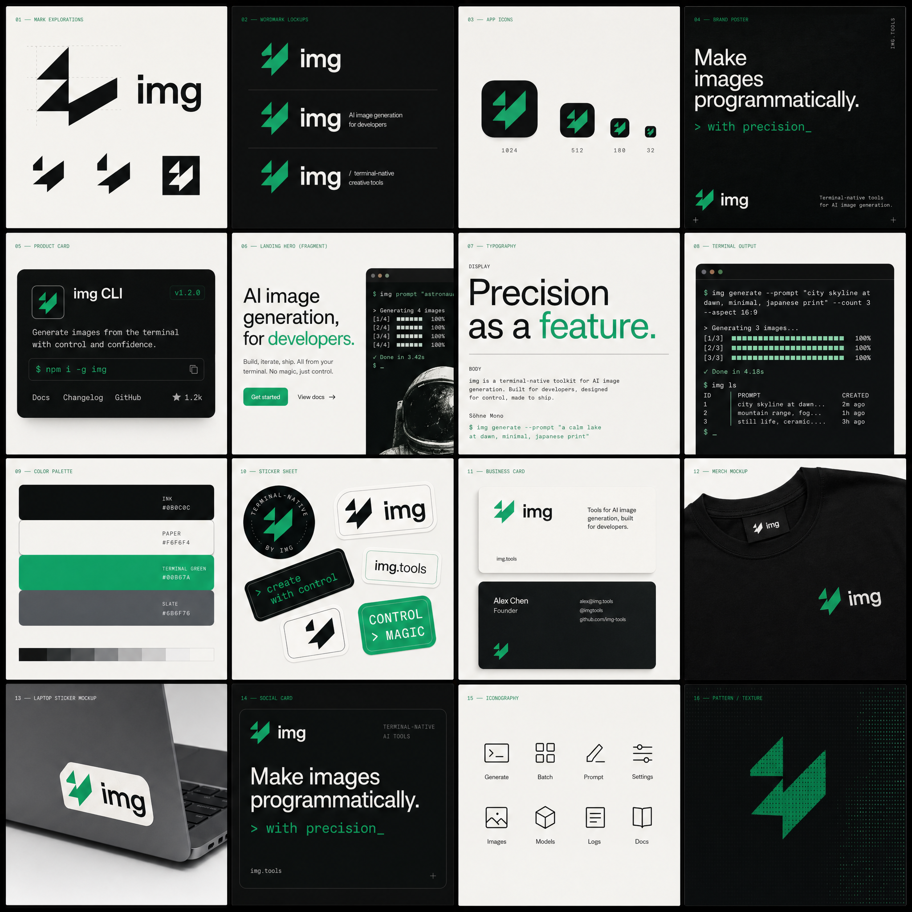

<p align="center">
  
</p>

<h1 align="center">img-cli</h1>

<p align="center">
  <strong>A taste-forward image-generation CLI built on <code>gpt-image-2</code>.</strong>
</p>

<p align="center">
  Curated style library &nbsp;·&nbsp; brand-identity boards &nbsp;·&nbsp; SVG mark extraction &nbsp;·&nbsp; Claude Code integration
</p>

<p align="center">
  <a href="LICENSE"></a>
  <a href="package.json">= 18"></a>
  <a href="package.json"></a>
</p>

---

## Why it exists

The model is the executor, not the strategist. Most image-gen CLIs are thin wrappers around an API and produce category-average results. `img-cli` is a **personal prompt library** that turns `gpt-image-2` into a taste-forward image tool — named-canon styles, stackable composition primitives, reference-anchored generation, and a brand-identity-board format that plays to the model's strength at composing dense, cohesive layouts rather than isolated marks.

## Quick start

```bash
npm install -g github:Dexin-Huang/img-cli
img init                              # one-time setup: API key + skill; optional venv
img generate "a single matte ceramic bottle of hand wash" --style studio-luxury
img viewer                            # starts localhost:3000 to review outputs
```

That's it. Three commands. Output lands in `./output/` of whatever directory you ran `img` from.

## What it generates

The dominant pattern is **brand-identity boards** — a single image that is a 16-tile cohesive identity system (logo lockups, wordmarks, app icons, posters, typography specimens, color palette, mockups). Plays to what `gpt-image-2` is genuinely good at:

<p align="center">
  
</p>

Then extract a clean SVG mark from any board with a single command:

```bash
img extract-mark output/brandboard-foo.png
# → output/brandboard-foo-mark.png   (isolated, black-on-white)
# → output/brandboard-foo-mark.svg   (real vector path, drop into Figma)
```

## Commands

| Group | Commands |
|---|---|
| **Setup** | `init`, `install --skills`, `install --venv` |
| **Generate** | `generate`, `edit`, `remove-bg`, `extract-mark` |
| **Library** | `styles`, `mods`, `refs`, `save-style`, `save-mod`, `save-ref` |
| **Review** | `viewer` (browser at `localhost:3000`) |

Run `img help` for the full flag surface.

## Composition flags

```
--style S         Base preset (one per call)        — see `img styles`
--mod NAME        Stackable prompt modifier         — repeatable
--ref NAME|PATH   Reference image (library or path) — repeatable
--no PHRASE       Negative prompt phrase            — repeatable
--size 1K|2K|4K|<W>x<H>
--ratio 1:1|16:9|3:2|...
--quality low|medium|high|auto
--provider openai|gemini
```

## How it works

```
your prompt + chosen style preset + stacked modifiers + named refs + negatives
            └──────────────────┬────────────────────┘
                               ▼
                   structured-brief assembly
                               │
                               ▼
                          gpt-image-2
                               │
                               ▼
              output/<name>.png  +  <name>.json sidecar
                                     (full recipe recorded)
```

Every generation writes a sidecar JSON next to the image with the exact recipe — prompt, full assembled prompt, style, mods, refs, negatives, size, ratio, quality, provider, model, timestamp. Reproducible and auditable.

## Library

After `img init`, your library lives at `~/.img-cli/library/{styles,mods,refs}/` (or in the repo if you cloned it for development). The package ships eight curated style presets — `studio-luxury` (Aesop / Kinfolk product still-life), `brand-board` (full identity systems), `macicon-tactile` (Things 3 / Bear pillowy macOS icons), `logo` (single-silhouette brand marks), plus generic `photo`, `watercolor`, `technical`, `ui-mockup`.

Grow it with `img save-style`, `img save-mod`, `img save-ref`. Package upgrades won't clobber your additions.

## Claude Code integration

`img install --skills` installs a Claude Code skill at `~/.claude/skills/img-cli/` (or `$CLAUDE_CONFIG_DIR/skills/img-cli/`). After that, `/image <prompt>` from any project routes through `img` with style-inference and per-project output paths.

## Troubleshooting

- **`Missing OPENAI_API_KEY`** — run `img init`.
- **`extract-mark` fails with venv-related error** — run `img install --venv` (needs Python 3 on PATH).
- **`remove-bg` fails** — needs `ffmpeg` on PATH.
- **`fetch failed` mid-generation** — transient OpenAI flake; retry. The CLI exits non-zero so a wrapping script can detect it.

## Stability

`v0.1.0`. The CLI surface (`generate`, `edit`, `remove-bg`, `extract-mark`, library commands) is stable. The output sidecar JSON schema is stable — older sidecars from earlier versions remain readable. Minor version bumps may add fields to sidecars (additive) or new commands; major version bumps may rename or remove things.

## License

MIT — see [LICENSE](LICENSE).
