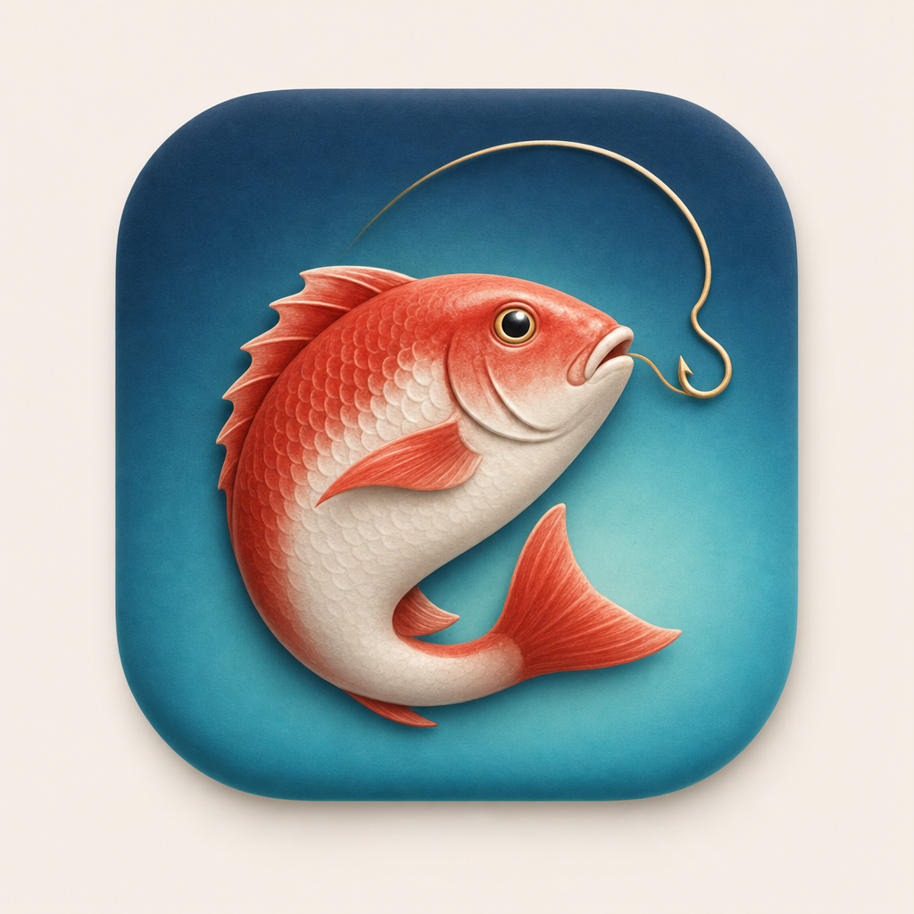
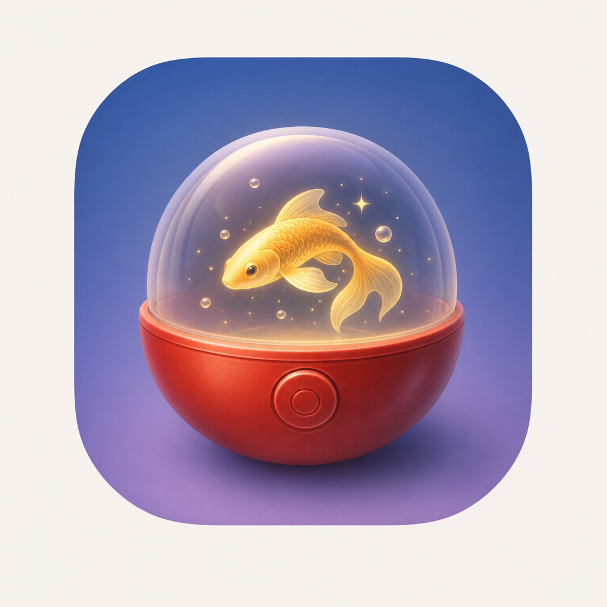
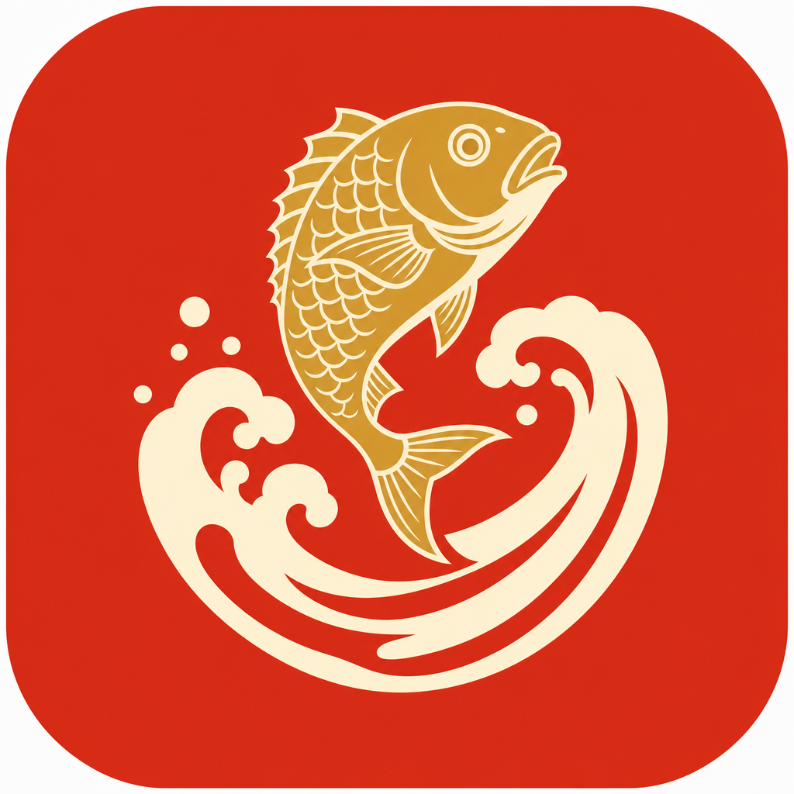
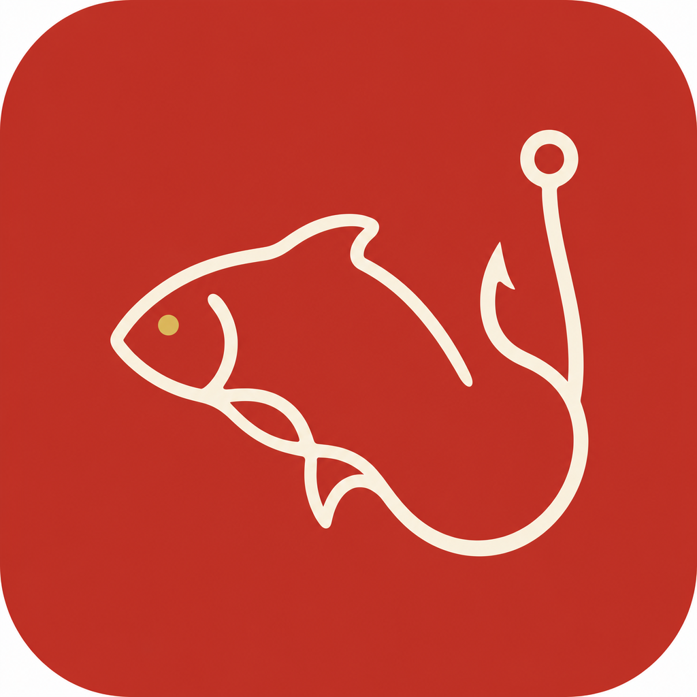

# Gallery — App icons & brand marks

Proven prompt → result pairs. Each entry is the exact prompt, the flags, and what the render is good for. Copy the *structure* (background → subject → details → constraints), not the literal subject. Keep this file curated: add an entry only when a render is genuinely reusable as a template, and prune ones that stop pulling their weight.

---

## Tactile 3D icon (Apple Design Award canon)

`--style macicon-tactile`, 1:1. Best for a polished, "cute collectible" home-screen icon with mass appeal. The soft-3D enamel material reads premium at every scale.

**Prompt:**
> App icon for a fishing gacha game. A plump red-and-white Japanese sea bream (tai) curved into a gentle C-shape, glossy enamel body catching soft top light, a single thin gold fishing line arcing from its mouth and curling into a hook in the upper corner, centered on a rounded-square tile with a deep indigo-to-aqua vertical gradient, a subtle radial glow behind the fish, pillowy soft-3D material in the Apple Design Award canon.

Why it works: background (gradient tile + radial glow) is set before the subject; the subject has a verb ("curved into a C-shape") and a material ("glossy enamel"); one accent detail (the gold line/hook) instead of a pile of them.

---

## Mechanic-in-the-icon (sell the hook)

`--style macicon-tactile`, 1:1. When the product has a signature mechanic, put its universal signifier *in* the icon. A gachapon capsule says "pull/collect" instantly — more differentiating than a literal subject.

**Prompt:**
> App icon for a fishing gacha game. A translucent gachapon capsule, top half clear acrylic and bottom half glossy crimson, a small luminous golden koi swimming inside among a few bubbles and sparkles, capsule centered on a rounded-square tile with a twilight blue-to-violet gradient, soft 3D pillowy materials, gentle top light and a crisp specular highlight on the dome.

Why it works: the capsule carries the concept; the subject (koi) is secondary cargo inside it. Lesson — ask "what object signifies the mechanic?" before defaulting to "draw the thing the app is about."

---

## Flat two-color crest (kamon / emblem)

No `--style` — describe the flat-vector look directly. Best for a *brand mark* that doubles as a logo: holds up on a splash screen, merch, and at tiny favicon sizes where 3D mush turns to noise. Most ownable and most "designed."

**Prompt:**
> App icon, flat modern vector style with a Japanese kamon family-crest sensibility. A single golden sea bream leaping over a cresting ukiyo-e wave drawn as two bold curved strokes, enclosed in an implied circle, warm vermilion-red background with cream and gold, clean geometric shapes, no gradients, confident negative space, centered for a rounded-square iOS tile.

Why it works: constraints do the heavy lifting — "no gradients", "two bold curved strokes", "confident negative space" force the flat-graphic discipline the model otherwise skips. Name the visual tradition (kamon) to anchor the canon.

---

## Single continuous line (minimal)

No `--style`. Cleanest, most modern, scales to the smallest sizes. Trades distinctiveness for restraint — strong when the surrounding grid is busy, weak when you need to pop.

**Prompt:**
> App icon, minimalist modern iOS style. One continuous cream-colored line drawing a stylized tai fish whose tail loops around to form a fishing hook, set on a solid deep vermilion rounded-square tile, a tiny gold dot for the eye, generous negative space, flat and confident, no gradients.

Why it works: "one continuous line … whose tail loops around to form a fishing hook" is a *gesture*, not an adjective. The double-duty shape (fish + hook from one stroke) is the kind of specific the model can only produce when you describe the path, not the vibe.

---

## Cross-cutting lessons

- **One accent, not five.** Each winning prompt has a single hero detail (the gold line, the capsule, the wave). Stacked details average out.
- **Set the tile and lighting before the subject.** "centered on a rounded-square tile with a <gradient>, soft top light" up front gives a coherent icon frame every time.
- **Name the tradition** (Apple Design Award canon, kamon crest, ukiyo-e wave) — it anchors the model far better than "Japanese-style."
- **Flat marks need explicit anti-gradient constraints**; tactile icons need explicit material words ("glossy enamel", "pillowy soft-3D").
